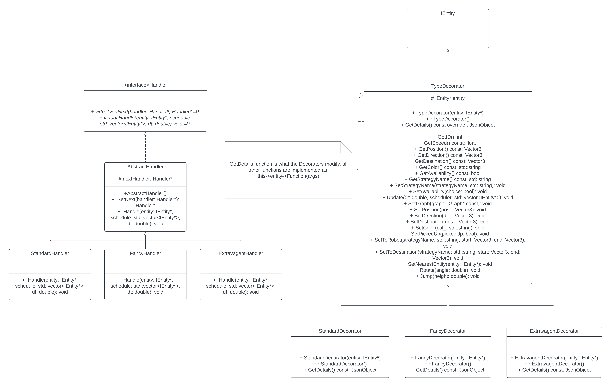
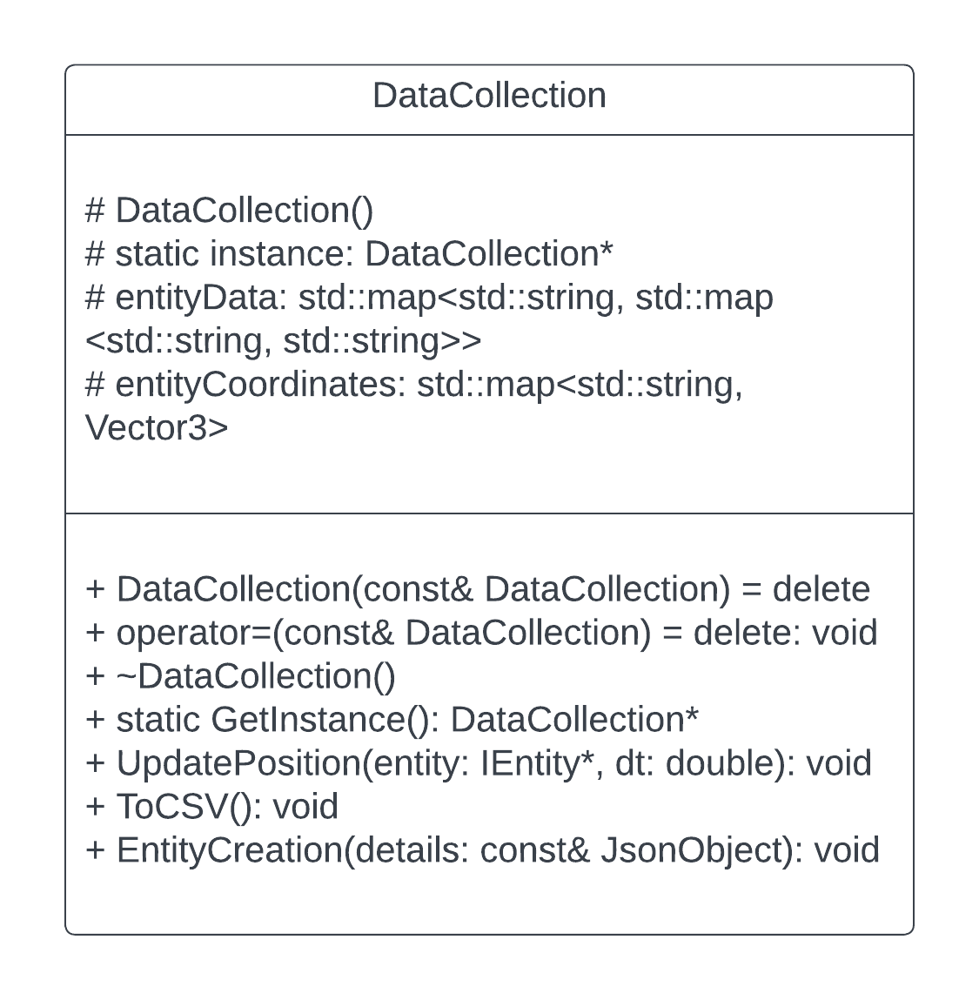

# Project Overview
The Transit Simulation System is a software development project that utilizes C++ backend to model a ride-hailing system similar to Uber and Lyft. The system facilitates ride scheduling through a web application, generating a "rider" entity that is served by a "driver" entity in the simulation. In this simulation, the riders and drivers are represented by robots and drones, respectively. The software maps the University of Minnesota campus and surrounding areas, incorporating pathing algorithms that emulate real-world routes taken by drivers. Routes can be dynamically generated using one of three pathfinding strategies - A*, depth-first, or Dijkstra. The software has been designed following object-oriented principles and conforms to SOLID design principles, allowing for extensibility and modification beyond its present scope.

# Docker Image

https://hub.docker.com/r/jfalk314/transitsim

To run the drone simulation after downloading the Docker image:

`docker run --rm -it -p 8081:8081 <image_name>`

Access the webpages for the simulation using steps 2 and 3 in "Starting The Simulation".

# Starting The Simulation

To run the simulation from the command line after cloning this repository, run the following commands:
```bash
# Go to the project directory
cd /path/to/repo/project
# Build the project
make -j
# Run the project (./build/web-app <port> <web folder>)
./build/bin/transit_service 8081 apps/transit_service/web/
```
Once the simulation is running, you can access the visualization and scheduling page by following these steps:

1. Open your web browser.
2. Navigate to `http://127.0.0.1:<port>` where `<port>` is the port number that the simulation is running on. By following the previous instructions, this will be port `8081`. This page contains the visualization of the simulation.
3. To schedule a trip, navigate to `http://127.0.0.1:<port>/schedule.html`. On this page, you can enter the passenger's name, select the starting and ending positions, choose a routing algorithm, and click "Schedule Trip" to schedule a trip.
4. After scheduling a trip, you can view the simulation of the drone and passenger on the visualization page you accessed earlier. You can change the camera view to lock onto specific entities by clicking them in the menu located in the top right corner of the page.


# What The Simulation Does
The simulation maps the University of Minnesota campus and enables rides for robots to be scheduled on a webpage and fulfilled in the simulation by a drone. The simulation allows for setting the pickup and drop-off locations for the robot rider, as well as the pathing strategy for the driver. The system is designed to use different pathfinding strategies such as A*, depth-first search, and Dijkstra.  Additionally, there are three types of drones in the simulation, standard, fancy, and extravagant. When a ride is created, the user must also select which type of drone they want to pick up the robot. The system enables the drone of specified type to pick up the robot and transport it to its final destination. Upon arrival, both the drone and robot celebrate with a dance dependent on the routing strategy for that trip. The simulation is also capable of tracking a variety of data about each entity. This data can be output to a CSV file at any point, allowing for analysis.

# New Features

## Entity Types

The Decorator design pattern is utilized in this feature to incorporate an extra field called "travelType" to a JsonObject which comprises entity details. This additional field defines three implementations of the Decorator, each corresponding to a distinct travel type: standard, fancy, and extravagant. Rather than setting the type during the object's construction, the travelType is only present when the IEntity object is wrapped. SimulationModel's CreateEntity function wraps all entities with a Decorator corresponding to their ID, ensuring that an equal amount of each type is present. The travelType is used by the Handler objects in the Chain of Responsibility, where each handler guarantees that a trip can only be initiated between a drone and a robot if both have the same travelType. Each travel type utilizes a distinct pathing strategy to reach the robot for pickup, but all types use the robot's strategy to travel to the final destination.

Upon launching the simulation, three drones are spawned, one for each type, each with a distinct appearance to indicate their travel type. A "Drone Type" button is also provided to choose the type of drone you want to complete the trip with the robot. Whenever a robot is spawned utilizing the schedule.html interface, the first available drone of the corresponding travelType completes the trip. This modeling of various ride types and allowing only certain drivers to serve certain riders (e.g. Uber XL, Uber Black, etc.) more accurately represents how rideshare services function. Additionally, this feature is easily scalable, enabling the addition of more travel types with minimal changes to the existing codebase. This feature's object-oriented design ensures travelType ride safety and needs only a small amount of additional user interaction, for the selection of drone type when a ride is scheduled.

<p align="center">
  
  <br>
  <em>UML for Entity Type Feature</em>
</p>


## Data Collection
This extension utilizes the Singleton design pattern to implement data collection for the Simulation.  This means that only one instance of a DataCollection class is utilized to track various data about each entity in the system. The class is capable of collecting both attribute data, such as name, type, and time in the simulation, and positional data, such as current position, current direction, and total distance. To output the collected data, a user can press the “Output to CSV” button on the scheduler webpage at any point during the simulation's lifetime. This will create a CSV file containing the collected data which is stored in the /data directory located at the root of the project files. The outputted CSV file can be used to evaluate and analyze a quantitative representation of the simulation's performance. The collected data can provide valuable information about the simulation's entities and their behavior. This information can be used to optimize the system and identify potential areas for improvement.

<p align="center">
  
  <br>
  <em>UML for Data Collection Feature</em>
</p>
